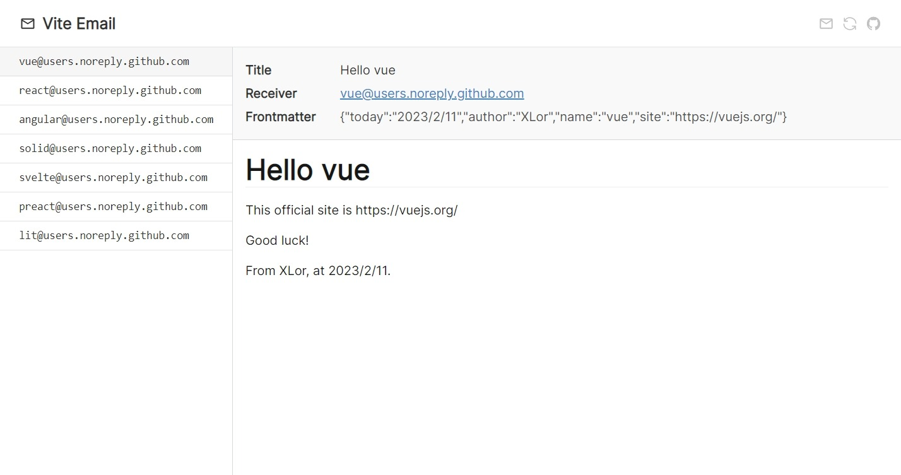

# vite-email

[](https://www.npmjs.com/package/vite-email) [](https://github.com/yjl9903/vite-email/actions/workflows/ci.yml)

Send emails rendered by Vite and Markdown-It automatically.



## Features

+ 📝 Render Markdown email template using csv table data
+ 🔥 Emails dev server with HMR support powered by [Vite](https://vitejs.dev/)
+ 📧 Automatically send emails

## Installation

```bash
npm i -D vite-email
```

You can also install it globally.

```bash
npm i -g vite-email
vmail --version
```

## Usage

Create a new workspace.

```bash
vmail init new-workspace
cd new-workspace
npm install
```

The created workspace contains some config files. `data.csv` stores the list of receivers and corresponding information. The `receiver` column specify the email of the receiver. `email.md` is the email content template to be rendered. You can use `{{ ... }}` to insert variable from `data.csv`.

For example, here is `data.csv`.

```csv
receiver,       name
bot@github.com, Bot
```

Here is `email.md`.

```md
# Hello {{ name }}
```

Then, you can start a dev server to preview the content of emails, or preview the render output with the option `--dry-run`.

```bash
vmail dev
# or
vmail send --dry-run
```

If everything is done, send emails with a simple command. This command may prompt you to type the sender email address and its password.

```bash
vmail send
```

The email template will be rendered to HTML using the csv data, and be sent to the receiver email. In this example, the following content will be send to `bot@github.com`.

```html
<h1>Hello Bot</h1>
```

### Configuration

Just modify the `vite.config.ts`.

```ts
// vite.config.ts

import { defineConfig } from 'vite-email';

export default defineConfig({
  email: {
    host: 'smtp.yeah.net',
    secure: true,
    auth: {
      user: 'yan_jl@yeah.net',
      // pass: '...',  // vmail will prompt if pass is empty
    },
    frontmatter: {
      receiver({ name }) {
        return `${name}@users.noreply.github.com`
      },
      today: new Date().toLocaleDateString(),
      author: 'XLor'
    }
  }
});
```

You can find this example [here](https://github.com/yjl9903/vite-email/tree/main/example).

## License

MIT License © 2022 [XLor](https://github.com/yjl9903)
